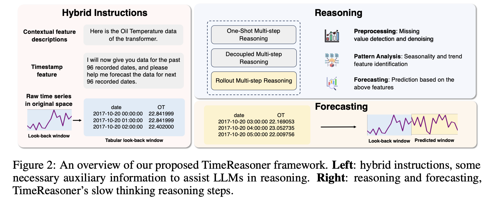

# TimeReasoner
---
Official implementation of the paper: **Can Slow-thinking LLMs Reason Over Time? Empirical Studies in Time Series Forecasting**
🔗 [Paper on arXiv](https://arxiv.org/abs/2505.24511)
>
> 🙋 Please let us know if you find out a mistake or have any suggestions!
> 
> 🌟 If you find this resource helpful, please consider to star this repository and cite our research:
```bibtex
@misc{wang2025slowthinkingllmsreasontime,
      title={Can Slow-thinking LLMs Reason Over Time? Empirical Studies in Time Series Forecasting}, 
      author={Jiahao Wang and Mingyue Cheng and Qi Liu},
      year={2025},
      eprint={2505.24511},
      archivePrefix={arXiv},
      primaryClass={cs.LG},
      url={https://arxiv.org/abs/2505.24511}, }
```


## 🌟 Introduction

We propose **TimeReasoner**, an extensive empirical study that formulates TSF as a conditional reasoning task. We design a series of prompting strategies to elicit inference-time reasoning from pretrained slow-thinking LLMs and evaluate their performance across diverse TSF benchmarks.

Our findings reveal that slow-thinking LLMs exhibit non-trivial zero-shot forecasting capabilities, especially in capturing high-level trends and contextual shifts. While preliminary, our study surfaces important insights into the reasoning behaviors of LLMs in temporal domains highlighting both their potential and limitations. We hope this work catalyzes further research into reasoning-based forecasting paradigms and paves the way toward more interpretable and generalizable TSF frameworks.

<div align="center">
  
</div>

<div align="center">
  
</div>

## Further Reading

1, [**Time Series Forecasting as Reasoning: A Slow-Thinking Approach with Reinforced LLMs**](https://arxiv.org/pdf/2506.10630).

**Authors**: Yucong Luo, Yitong Zhou, Mingyue Cheng, Jiahao Wang, Daoyu Wang, Tingyue Pan, Jintao Zhang

```bibtex
@article{luo2025time,
  title={Time Series Forecasting as Reasoning: A Slow-Thinking Approach with Reinforced LLMs},
  author={Luo, Yucong and Zhou, Yitong and Cheng, Mingyue and Wang, Jiahao and Wang, Daoyu and Pan, Tingyue and Zhang, Jintao},
  journal={arXiv preprint arXiv:2506.10630},
  year={2025}
}
```


