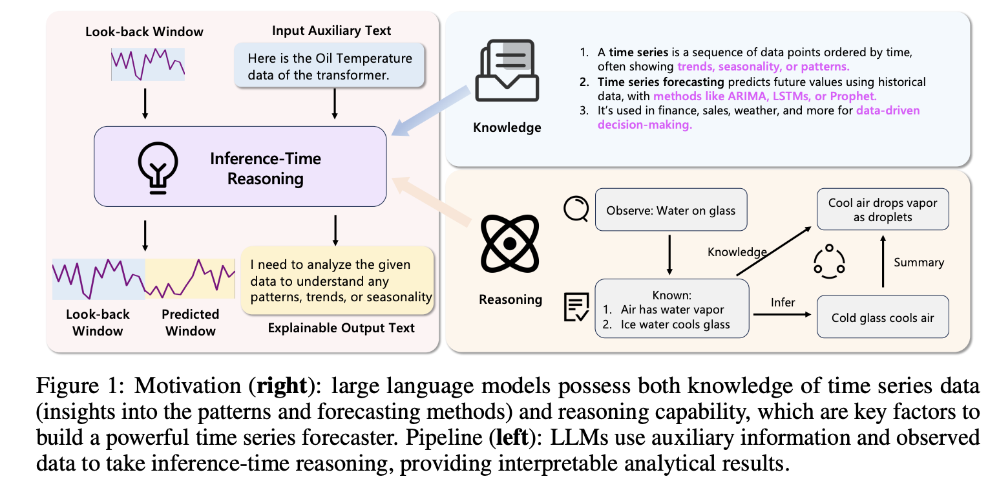

# TimeReasoner
---
Official implementation of the paper: **Can Slow-thinking LLMs Reason Over Time: Empirical Studies in Time Series Forecasting**

## 🌟 Introduction
We propose **TimeReasoner**, an extensive empirical study that formulates TSF as a conditional reasoning task. We design a series of prompting strategies to elicit inference-time reasoning from pretrained slow-thinking LLMs and evaluate their performance across diverse TSF benchmarks.

Our findings reveal that slow-thinking LLMs exhibit non-trivial zero-shot forecasting capabilities, especially in capturing high-level trends and contextual shifts. While preliminary, our study surfaces important insights into the reasoning behaviors of LLMs in temporal domains highlighting both their potential and limitations. We hope this work catalyzes further research into reasoning-based forecasting paradigms and paves the way toward more interpretable and generalizable TSF frameworks.

## Motivation

  

Time series forecasting (TSF) is a cornerstone task in numerous fields, including finance, energy, and healthcare. Its core goal is to predict the future trajectory of a target variable based on historical observations and auxiliary information. While existing methods (ranging from classical statistical models to modern deep learning) have achieved remarkable success, most of them adhere to a "fast-thinking" paradigm, directly mapping inputs to outputs through a single-step inference, lacking intermediate, explicit reasoning steps.

Meanwhile, "slow-thinking" large language models (such as ChatGPT-o1 and DeepSeek-R1) capable of multi-step reasoning have demonstrated impressive performance in various domains. This raises a key question: Can "slow-thinking" large language models effectively reason about temporal patterns to support time series forecasting, even in zero-shot scenarios? To this end, the research team proposed TimeReasoner, which reformulates TSF as a conditional reasoning task and systematically explores the reasoning behavior of LLMs on time series data.

## The Proposed TimeReasoner

  

TimeReasoner frames time series forecasting as a conditional reasoning problem, where the LLM generates forecasts by interpreting structured natural language prompts. Its core framework (shown in Figure 2) includes the following key components:
### 1. Hybrid Instructions
To support effective time series reasoning, TimeReasoner employs multimodal prompts, combining:
* **Raw time series in original space**: Directly using unnormalized raw data, it preserves the true magnitude and fluctuation of values, enabling the model to understand absolute values and real-world changes.
* **Timestamp feature**: Introducing raw timestamps enables the model to identify absolute temporal locations (such as specific dates or hours) and relative patterns (such as periodicity or time intervals), which is crucial for time series reasoning.
* **Contextual feature descriptions**: Provide contextual information to natural language descriptions, such as domain knowledge and channel-specific semantics, helping the LLM align numerical data with real-world meaning, enhancing task relevance and interpretability.

### 2. Reasoning Strategies
TimeReasoner explored three different reasoning paradigms to evaluate the capabilities of "slow-thinking" LLMs:
* **One-Shot Reasoning**: The LLM performs a comprehensive reasoning process on a given input, internally completing the required multi-step logic and directly outputting a complete set of predictions.
* **Decoupled Reasoning**: The LLM aims to produce a comprehensive output, but the process is decoupled. The model generates a partial thought, reflects on it, and then continues, forming a "generate-reflect-generate" cycle within a single reasoning shot to achieve more refined multi-step reasoning.
* **Rollout Reasoning**: The LLM generates predictions incrementally, producing a partial result at each step. This process involves multiple iterative rounds, with each output serving as context for the next, allowing the model to gradually build the final, complete result.

